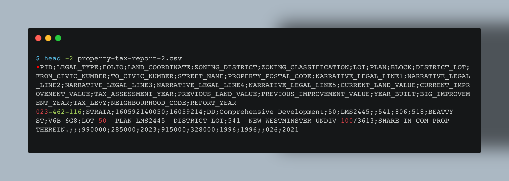
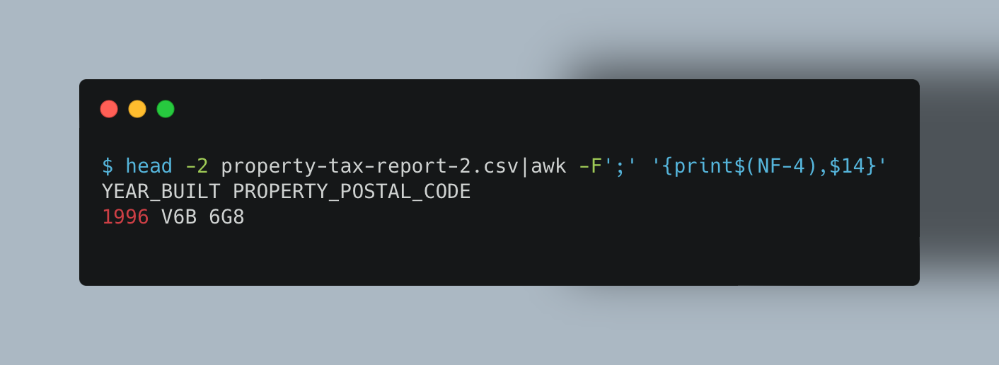
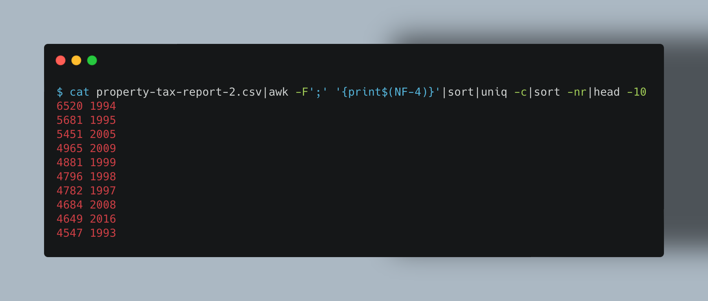
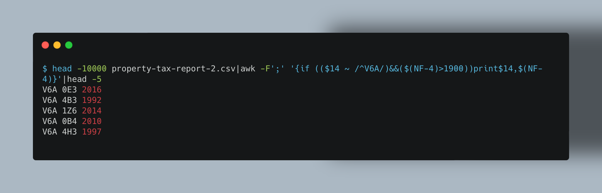
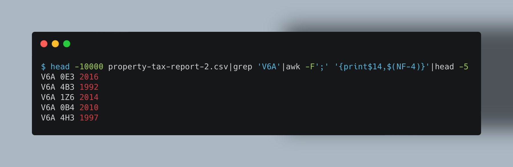
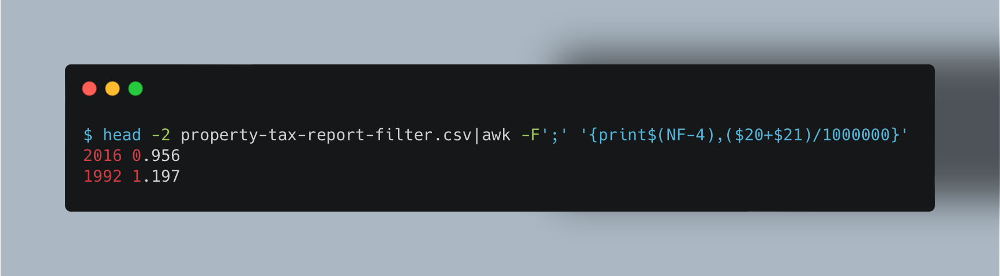

# grep = global regular expression print
Grep is a command-line tool used for searching and filtering text-based data. It is used to quickly search through a file, or multiple files, for simple patterns and basic regular expressions (BREs). Grep can also be used to filter output from other commands, or to search for specific patterns within a file.

Examples:

Find all occurrences of the pattern ‘patricia’ in a file:

               $ grep 'patricia' myfile

   Same as above but looking only for complete words:

               $ grep -w 'patricia' myfile

   Find all occurrences of the pattern ‘.Pp’ at the beginning of a line:

               $ grep '^\.Pp' myfile

   Find all lines in a file which do not contain the words ‘foo’ or ‘bar’:

               $ grep -v -e 'foo' -e 'bar' myfile
        
        
#  AWK
AWK is a programming language, created by Aho, Weinberger & Kernighan, designed for text processing and typically used as a data extraction and reporting tool. It is a powerful command-line tool that allows users to parse text files and perform operations on the data contained within them. AWK can be used to search for patterns within a file, perform calculations on the data, and print out the results.

Examples:
       
       
   Print lines longer than 72 characters.
       
       length($0) > 72
   Print first two fields in opposite order.
       
       { print $2, $1 }
   
   Same, with input fields separated by comma and/or spaces and
              tabs.
              
       BEGIN { FS = ",[ \t]*|[ \t]+" }
             { print $2, $1 }
             { s += $1 }
       END  { print "sum is", s, " average is", s/NR }

   Add up first column, print sum and average.
              /start/, /stop/
              Print all lines between start/stop pairs.

       BEGIN     {    # Simulate echo(1)
            for (i = 1; i < ARGC; i++) printf "%s ", ARGV[i]
            printf "\n"
            exit }
# sed = stream editor
Sed is a command-line tool used for editing text files. It can be used to search for and replace specific text patterns, insert or delete lines from a file, and more. Sed is commonly used for automated text processing, such as for batch editing of multiple files at once.

Examples:

   Replace ‘bar’ with ‘baz’ when piped from another command:

           echo "An alternate word, like bar, is sometimes used in examples." | sed 's/bar/baz/'

   Using backlashes can sometimes be hard to read and follow:

           echo "/home/example" | sed  's/\/home\/example/\/usr\/local\/example/'

   Using a different separator can be handy when working with paths:

           echo "/home/example" | sed 's#/home/example#/usr/local/example#'

   Replace all occurances of ‘foo’ with ‘bar’ in the file test.txt, without
     creating a backup of the file:

           sed -i '' -e 's/foo/bar/g' test.txt
#            The "|" (pipe) symbol
The "|" (pipe) symbol is a command used in Linux to direct the output of one command to another. It allows you to take the output of one command and use it as the input to another command. 
For example, you could use the "ls" command to list the contents of a directory, and then pipe the output of that command to the "grep" command to search for a specific file.

# Now let us get our hands dirty 
Imagine you are a data scientist working at a real-estate company. You download a property_tax_report from this webpage. The dataset contains information on properties from BC Assessment (BCA) and City sources in 2021.

You may think that for a newly built house, it tends to have a higher price than the ones built decades ago. 
So let us clean the data for this idea.
## First glance of the data

	head -2 property-tax-report-2.csv
Here **head -2** means to print first 2 lines from the data file. With this we could see how the header and the data looks like. 

	Since the housing price varies a lot by locations, we will only consider the houses whose postcode starts with 'V6A'. Furthermore, we remove the houses that were built before 1900.
### 	locate the colums you what to use the filter
	head -2 property-tax-report-2.csv|awk -F';' '{print$(NF-4),$14}'
Here the **print$(NF-4),$14** means we only print the YEAR_BUILT and the PROPERTY_POSTAL_CODE columns.

### check the top10 of the buildings number by year
	cat property-tax-report-2.csv|awk -F';' '{print$(NF-4)}'|sort|uniq -c|sort -nr|head -10
Here **sort|uniq -c|sort -nr** part means we sort the build year and then uniq count the year, so we could have the number of the buildings that build from each year. Then we sort the numbers again to show the top 10. 

### make the filter
	head -10000 property-tax-report-2.csv|awk -F';' '{if (($14 ~ /^V6A/)&&($(NF-4)>1900))print$14,$(NF-4)}'|head -5

Here **$14 ~ /^V6A/** means column 14 start with V6A.
you could also replace above with this:
	  
	head -10000 property-tax-report-2.csv|grep 'V6A'|awk -F';' '{print$14,$(NF-4)}'|head -5

seems it works!
### output the result to a file
	cat property-tax-report-2.csv|awk -F';' '{if (($14 ~ /^V6A/)&&($(NF-4)>1900))print$0}'>property-tax-report-filter.csv
Just remember the header will be removed after this.
To make it become a "real" comma-separated values file just add:
    sed "s/;/,/g"
    
    cat property-tax-report-2.csv|awk -F';' '{if (($14 ~ /^V6A/)&&($(NF-4)>1900))print$0}'|sed "s/;/,/g">property-tax-report-filter.csv

### last move
We create a new column and value it as (CURRENT_LAND_VALUE+ CURRENT_IMPROVEMENT_VALUE)/1000000 then we could study the whether YEAR_BUILT and HOUSE_PRICE are correlated. 

    head -2 property-tax-report-filter.csv|awk -F';' '{print$(NF-4),($20+$21)/1000000}'

